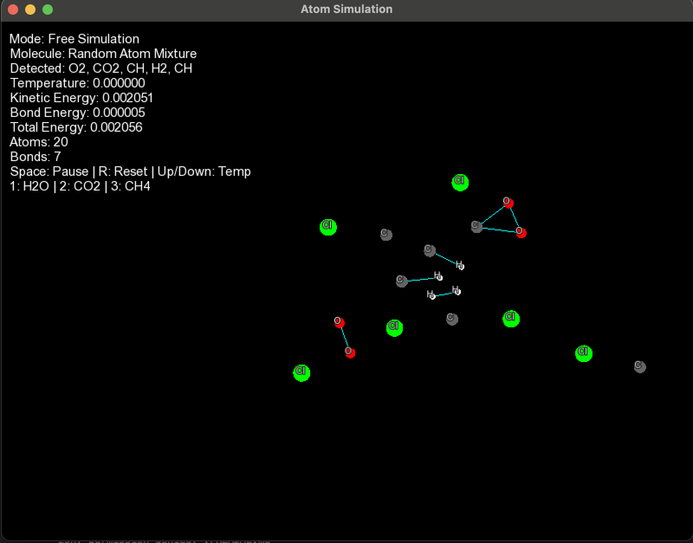

# Atom Simulation Engine

A real-time 2D molecular simulation built in C++ with SFML. This project visualizes atoms as moving particles and models simplified bonding, bond breaking, collision behavior, molecule recognition, temperature effects, and energy tracking.

## Features

- Real-time 2D atom simulation
- Dynamic bond formation and breaking
- Temperature-controlled motion
- Molecule recognition system
- Bond stabilization physics
- Collision handling
- Energy tracking system
- Preset molecules:
  - H2O
  - CO2
  - CH4
- Free simulation sandbox mode
- Interactive controls and live UI

## Controls

| Key | Action |
|-----|--------|
| Space | Pause simulation |
| R | Reset simulation |
| Up Arrow | Increase temperature |
| Down Arrow | Decrease temperature |
| 1 | Spawn H2O |
| 2 | Spawn CO2 |
| 3 | Spawn CH4 |

## Build Instructions

### Requirements

- C++17
- SFML 2.5+

### macOS Build

```bash
g++ -std=c++17 main.cpp Simulation.cpp Renderer.cpp -o main \
-I/opt/homebrew/include \
-L/opt/homebrew/lib \
-lsfml-graphics \
-lsfml-window \
-lsfml-system
```
### Run

```bash
./main
## Demo

 
